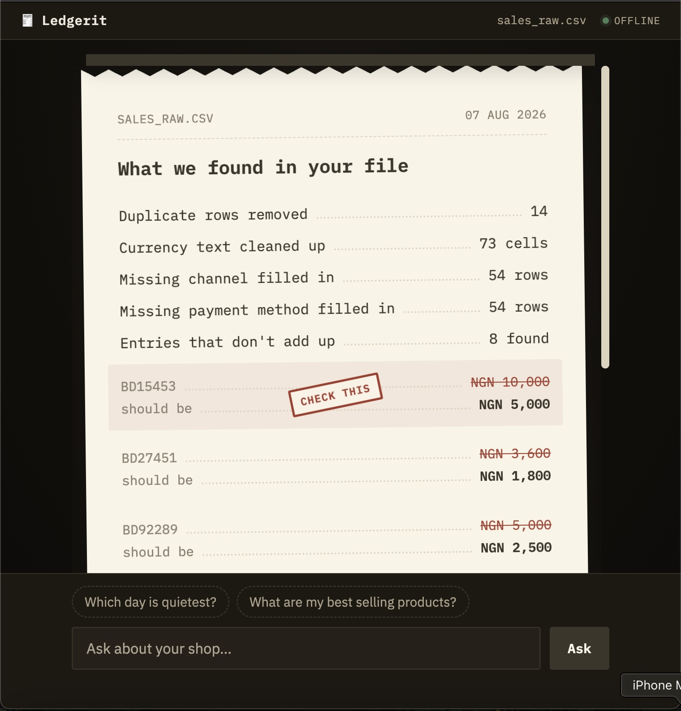

# Ledgerit

Offline AI bookkeeper for Nigerian small businesses. Cleans messy sales
records, answers questions about them, and flags entries that don't add up.
Runs entirely on an 8 GB laptop with no internet.



**How it works:** pandas computes every figure; the local model only explains
what pandas already calculated. It never does arithmetic, and every number in
its output is checked against the figures it was given.

---

## Setup

```
pip install -r requirements.txt
```

You also need [llama.cpp](https://github.com/ggml-org/llama.cpp) installed, and
the model weights:

```
bash download_model.sh
```

---

## Running it

**As an app** — a dedicated window, not a browser tab:

```
python3 launch.py
```

Starts a local server on `127.0.0.1` and opens Ledgerit in your installed
Chrome, Chromium, Edge or Brave using `--app` mode. Falls back to your default
browser if none are installed. Closing the window shuts the server down; so
does Ctrl+C.

**As a CLI:**

```
python3 main.py data/sales_raw.csv
```

---

## Supported files

| | |
|---|---|
| **Formats** | `.csv`, `.xlsx` |
| **Encodings** | UTF-8, UTF-8 with BOM, Windows-1252, UTF-16 — detected automatically |
| **Delimiters** | comma, semicolon, tab — sniffed automatically |
| **Required columns** | `date`, `product`, `qty`, `unit_price`, `total` |
| **Not supported** | `.xls`, PDF, scanned or photographed input |

Column names are matched after normalising, so spelling and casing don't
matter. If a required column is missing, Ledgerit tells you which ones it
needed and which ones it found.

Load your own file by clicking the filename in the top bar, or drop it onto the
window.

---

## What it does with a file

1. **Cleans it** — parses mixed date formats, strips currency text from number
   columns, removes duplicate rows, normalises category casing.
2. **Flags what doesn't add up** — where a recorded total doesn't equal
   quantity × unit price, both figures are shown. Nothing is silently
   corrected.
3. **Answers questions** in plain English — best and worst sellers, monthly
   trend, quietest day, breakdown by vendor, channel or payment method.

---

## Offline

No network calls at any point after installation. The interface includes a
live indicator that watches every request the page makes and latches red
permanently if anything non-local is ever attempted.

---

## Project layout

```
metadata.json        ADTC submission metadata
download_model.sh    Fetches the GGUF weights
REPORT.md            Technical report
cleaner.py           Deterministic cleaning. No model involved.
analyst.py           BM25 retrieval + eight pandas analyses
explain.py           Model narration, routing, number verification
server.py            Local HTTP server
launch.py            Starts the server and opens the app window
web/                 Interface
docs/                Evaluation writeups
tests/               Routing accuracy and quantization comparison
```

---

## Model

SmolLM3-3B, Q3_K_M quantization, GGUF, served through llama.cpp.
1.5 GB on disk, 1,976 MB peak RSS, 6.13 tok/s on CPU.

Quantized and published at
[huggingface.co/clintonlynx](https://huggingface.co/clintonlynx).

Full benchmarks, design decisions and known limitations are in
[REPORT.md](REPORT.md).

---

## Licence

Apache-2.0.