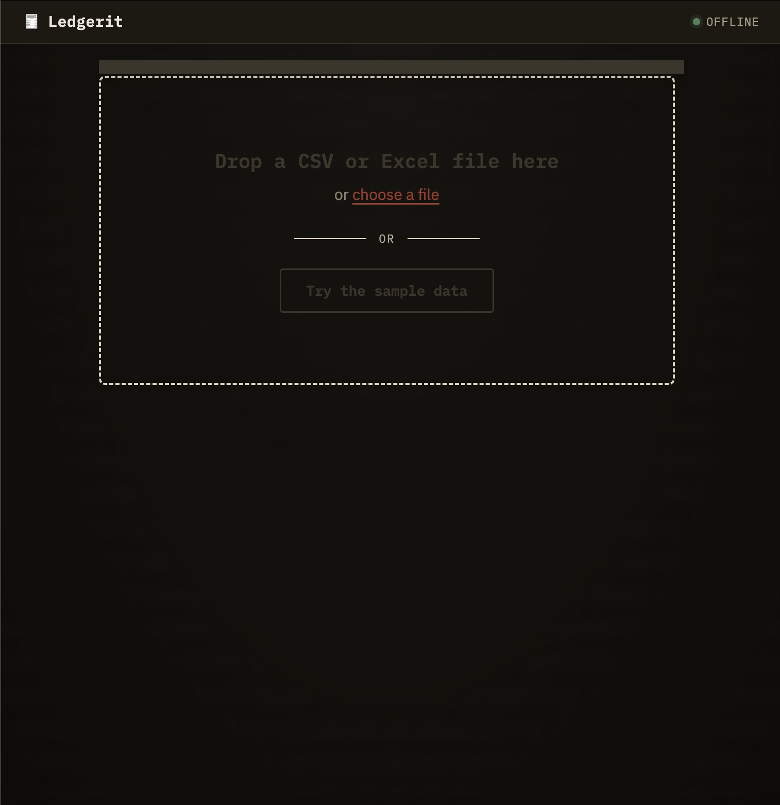
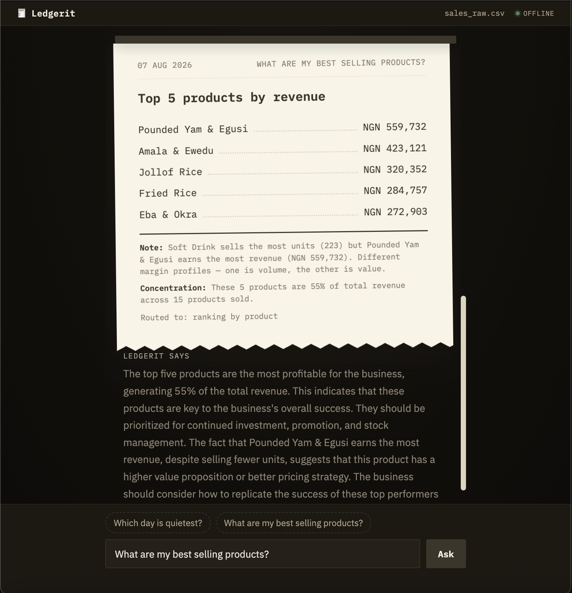

# Technical Report, Ledgerit
### An offline bookkeeping assistant for Nigerian small businesses

| | |
|---|---|
| **Team ID** | ledgerit |
| **Domain** | corporate_enterprise |
| **Model** | SmolLM3-3B, Q3_K_M quantization, GGUF |
| **Runtime** | llama.cpp |
| **Repository** | https://github.com/clinton-lynx/ledgerit |

---

## Problem

### 1.1 The user

My mother is a petty trader. When I was in secondary school she would leave me
in the shop with the same instruction every time: write it down. What sold, how
many packs, how much, and whether they paid cash or took it on credit.

Writing it down was never the problem. The problem came at month end, when she
sat with that notebook and a calculator and tried to work out whether the month
had actually made money. The money was never in one place. Some of it was cash.
Some was still on the shelf as unsold goods. Some was with people who had taken
things on credit and not come back. Three separate piles that had to reconcile,
with no way to check her own working. It took hours, and at the end of it she
still could not tell you with confidence whether the month had been good.

Years later I worked at a grocery store to buy my first laptop, and watched a
supervisor do the same reconciliation at the end of every day, then every week,
then every month, chasing entries typed twice during rush hour and prices keyed
in as text.

Neither of them was bad at the job. Neither had a tool. And no small shop is
hiring a data analyst.

Neither case is unusual. Millions of Nigerian shops, restaurants and campus
vendors keep their sales the same way: in a notebook, or in a spreadsheet that
mixes several date formats within one column, carries currency symbols inside
numeric fields, contains orders entered twice, and includes totals that do not
equal quantity multiplied by unit price. The specifics differ; the shape of the
problem does not.

### 1.2 The gap

Software that answers these questions has existed for years. It assumes a stable
internet connection and a card that works in dollars.

For a shop turning over NGN 60,000 on a good day, a twenty-dollar monthly
subscription is not a small line item. It competes directly with restocking.
Mobile data is metered. Grid power is intermittent. And the laptop on the counter
is an 8 GB refurbished machine, not something bought to run this.

Each barrier is individually surmountable. Together they are why the capability
exists and the tool does not.

### 1.3 What the files actually look like

The mess in these files is not random. It follows patterns, and the cleaning
logic was built around the ones that recur:

- **Dates entered several ways in one column.** The person writes the date the
  way they say it, and that is not always the way they wrote it last week.
- **Currency symbols inside number columns.** NGN typed in front of some prices
  and not others, which turns the whole column into text.
- **The same sale recorded twice**, usually when the entry is interrupted and
  resumed.
- **Totals corrected by hand.** A customer negotiates, the total is overwritten,
  and it no longer equals quantity times price.
- **Blank cells on busy days.** Payment method and channel are the first fields
  to go unfilled when the shop is full.

None of these are exotic. They are what a spreadsheet looks like when it is kept
by someone running a business rather than by someone maintaining a database.

### 1.4 What Ledgerit does

Ledgerit loads a sales export in whatever state the owner keeps it, cleans it,
flags entries that do not add up, and answers plain-English questions about the
business. Any answer can be exported as a receipt-styled PDF the owner can keep
or send on. It runs entirely on the machine the business already owns, with no
network connection at any point after installation.

It does not require the file to be shaped a particular way. Where column names
differ from the ones it expects, it asks the owner to confirm a mapping rather
than rejecting the file. Where a workbook has several sheets, it asks which one.
Where the header is not the first row, it detects the header, and asks for
confirmation when it is not confident.

---

## Design Decisions

### 2.1 System overview

Ledgerit is a local application with four stages.

```
  sales file
      |
      v
  +-------------+   deterministic Python. Parses mixed date formats,
  |  CLEANING   |   strips currency text, removes duplicates, normalises
  +-------------+   category casing, flags arithmetic that does not add up.
      |
      v
  +-------------+   BM25 index over row-level records. No embedding model,
  |  RETRIEVAL  |   no second download, no additional resident memory.
  +-------------+
      |
      v
  +-------------+   pandas computes every figure. Eight analysis functions,
  |  ANALYSIS   |   selected by a model classification step.
  +-------------+
      |
      v
  +-------------+   SmolLM3-3B, Q3_K_M, via llama.cpp. Receives figures
  | NARRATION   |   already computed and explains them. Never calculates.
  +-------------+   Output is verified against the supplied figures.
      |
      v
  answer
```

**The governing rule: pandas computes, the model narrates.** The language model
never performs arithmetic. It receives figures the analysis stage has already
calculated and explains what they mean for the business. This separation exists
because a small model asked to compute over tabular data produces plausible
wrong numbers, and a bookkeeping tool that misstates a figure is worse than no
tool.

**The model.** SmolLM3-3B by HuggingFaceTB, quantized to Q3_K_M and served
through llama.cpp. 3 billion parameters, 1.5 GB on disk, 1,976 MB peak RSS.

Each decision below follows the same structure: what was at stake, what was
considered, what was chosen, and what the evidence was.

### 2.2 Model selection and quantization

**At stake.** Speed and memory account for 50% of the competition score, and
both are determined entirely by this choice.

**Considered.** Two base models across four quantizations, benchmarked cold.
Cold measurement matters: a memory-mapped GGUF already resident in the OS page
cache generates faster and reports higher RSS than a first read, and the audit
runs cold on a fresh machine. Three consecutive runs of the same file on our
development machine gave 6.13, 7.11 and 16.23 tok/s as cache residency
accumulated.

| Model | Quantization | Throughput | Peak RSS | S_eff |
|---|---|---|---|---|
| Phi-4-mini-instruct (3.8B) | Q4_K_M | 5.85 tok/s | 3,819 MB | 45.4 |
| SmolLM3-3B | Q4_K_M | 8.26 tok/s | 2,863 MB | 59.1 |
| SmolLM3-3B | IQ4_XS (imatrix) | 6.04 tok/s | 2,157 MB | 69.2 |
| **SmolLM3-3B** | **Q3_K_M** | **6.13 tok/s** | **1,976 MB** | **71.8** |

**Decided.** SmolLM3-3B at Q3_K_M.

**Evidence.**

*Phi-4-mini rejected*, 955 MB heavier and slower than SmolLM3 in the winning
configuration, despite comparable parameter count. Architecture affects CPU
inference more than parameter count does.

*IQ4_XS rejected*, dominated by Q3_K_M on both axes: slower and heavier.
Importance-matrix quantization did not pay for itself with a generic calibration
corpus.

*Q4_K_M versus Q3_K_M* was the genuine decision. Q4 is 35% faster; Q3 uses
887 MB less. Q3's efficiency advantage is 12.7 points and computable exactly.
Q4's speed advantage is worth an amount that depends on the fastest submission
in the field, which cannot be known before submissions close. We took the
certain gain over the contingent one.

*Counterintuitive finding worth recording:* Q3_K_M is slower than Q4_K_M despite
being 887 MB smaller. Q3's dequantization scheme is more complex, so the CPU
does more work per weight. Smaller does not imply faster on CPU-only inference.

Both Q3_K_M and IQ4_XS were quantized by us and published publicly at
`huggingface.co/clintonlynx`.

### 2.3 Architecture: deterministic computation with model narration

**At stake.** Whether a business owner can trust the figures Ledgerit states.

**Considered.** The conventional approach is to let the model reason over the
data directly, as a general-purpose assistant would.

**Decided.** All arithmetic in pandas. The model receives computed figures and
explains them; it never calculates.

**Evidence.** A 3-billion-parameter model asked to compute over tabular data
produces plausible wrong numbers. Measured on our candidate models before
mitigation: one to two unsupported figures per 10 answers. In one case the model
computed a month-over-month difference and reported it wrong by 10. On a
bookkeeping tool that is not an acceptable failure mode.

**Residual risk.** Separation alone proved insufficient. Models still
occasionally performed arithmetic despite explicit instruction not to. We added
a verification layer: every number in the model's output is extracted and
checked against the figures supplied to it. On mismatch, generation is retried
once with a stronger instruction; if it still fails, the unsupported figures are
flagged visibly in the interface rather than passed silently.

**Outcome.** Zero unsupported numbers reaching final output, across 30 answers
and three candidate models. Both genuine hallucinations observed before
mitigation were caught and corrected on retry.

### 2.4 Retrieval: BM25 over local records

**At stake.** Grounding answers in the specific business's data. This is also
our cross-disciplinary integration.

**Considered.** A sentence-embedding model for semantic retrieval, which is the
default choice for retrieval-augmented generation.

**Decided.** Lexical BM25 over row-level records, implemented in approximately
40 lines with no external dependencies.

**Evidence.** An embedding model is a second model download and several hundred
MB resident on a machine with 8 GB total, competing directly with the language
model against the 7 GB ceiling. Business records share vocabulary with the
questions asked about them, such as product names, vendor names and payment
methods, so lexical matching suits this corpus rather than being a compromise
forced by the constraint.

**Why this is load-bearing.** Without the retrieval and analysis layer the model
cannot answer a single question about the business, because it never sees the
underlying data. The pairing of a local language model with deterministic data
analysis over the business's own records is not decorative; remove either side
and the system does nothing.

### 2.5 Question routing

**At stake.** Mapping a plain-English question to the correct analysis. Most of
our measurement effort went here. Full log in `docs/routing-evaluation.md`.

**Considered and measured.**

| Approach | Accuracy | Latency | Outcome |
|---|---|---|---|
| Keyword regex | not measured | free | Could not cover real phrasing variety |
| Model classification, initial prompt | 68.8% | 2.6 s | Baseline |
| Two-stage: dimension, then view | 51.0% | 10.2 s | Regressed 18 points at 4x latency |
| Single call with dimension hint | 83.0% | 3.1 s | Improvement |
| **Category rename for parallel structure** | **93.8%** | **3.1 s** | **Shipped** |

**Decided.** Single-call model classification into eight labelled categories,
with descriptions restructured so that no description word competes with a label
key.

**Evidence, two findings worth recording.**

*The two-stage rewrite fixed its target and broke three other categories.*
Splitting classification into dimension and view took `ranking_by_vendor` from
20% to 100%, while `bottom_products`, `monthly_trend` and `quiet_days`, all
previously at or near 100%, collapsed. Net regression of 18 points. This was
caught only because we measured the full question set rather than the eight
cases that had prompted the change.

*The final fix was naming, not logic.* Category descriptions contained nouns
that the model emitted *instead of* the label key: asked to classify "what are
my best sellers", it replied `bestsellers`, a word taken from our own
description text. Removing those collision nouns and giving every label parallel
structure raised accuracy from 68.8% to 93.8% and made classification fully
deterministic across runs, where the previous prompt had been intermittently
unstable.

**Measurement note.** Classification is not fully deterministic even at
temperature 0.0, owing to floating-point non-associativity in multi-threaded
inference. All routing figures here are medians of three runs. Earlier internal
figures of 95% and 77% were single-run point estimates on a smaller question set
and did not survive re-measurement.

### 2.6 The chat template failure

**At stake.** Whether our submitted weights behave correctly in the runtimes
judges use. This was the most consequential finding of the project.

**The problem.** Our own quantizations lacked `tokenizer.chat_template`
metadata; only the upstream Q4_K_M carried it. Without that key, inference
runtimes silently fall back to a template the model was never trained on. No
error is raised and no warning is printed.

**Why it was nearly missed.** The failure presents differently by runtime, and
the more dangerous case is not the obvious one.

| Runtime | Behaviour without the template |
|---|---|
| llama.cpp | Visible corruption. `<<SYS>>` tokens, echoed prompts, `[/INST]` leaking into output. Obviously broken. |
| Ollama | *Fluent* output that silently ignored the system prompt entirely. |

Under Ollama the model performed arithmetic it was instructed never to perform
(559,732 divided by 221, giving roughly 2,528, a figure supplied nowhere in the
prompt), ran to five paragraphs when instructed to write three sentences, and on
two of three test prompts never terminated at all. One required manual
interruption after 17 minutes.

A judge running our weights in Ollama would not have seen obvious corruption.
They would have seen a runaway generation inventing figures: precisely the
failure our architecture exists to prevent, arriving through a channel our
architecture could not defend, because the system prompt never reached the model
at all.

**Fix.** `gguf_new_metadata.py --chat-template-file` copies tensor data verbatim
and rewrites only the metadata header. 14 seconds per file, no requantization,
no original F16 weights required. Verified by sha256 and by the exact size delta
of 5,536 bytes.

**Verification.** Confirmed in Ollama specifically, not only in our development
harness, because that is the runtime the competition FAQ states judges use.
Three Ledgerit-shaped prompts through `ollama run` on the templated model
produced coherent, correctly scoped, correctly terminated output with no
template leakage. The untemplated original, same prompts, same runtime,
reproduced the failures above.

### 2.7 Reading files that were not designed for us

**At stake.** Whether Ledgerit works on a real business's spreadsheet or only on
one shaped like our own sample.

**Considered.** Requiring canonical column names, which is what we shipped
first. A file using Item, Rate and Amount rather than product, unit_price and
total was rejected outright, with a message naming what was missing.

**Decided.** Ask rather than reject. Where the required columns are not found,
Ledgerit shows a mapping step with best-guess preselections drawn from string
similarity and a small synonym table, plus sample values from each source column
so the owner can confirm the choice. Multi-sheet workbooks prompt for a sheet.
Where the header row is not row one, a scoring pass over the first fifteen rows
detects it, and asks when the result is not confident.

**Evidence.** Tested against a building-materials sales export with columns named
Date, Invoice No, Item, Qty, Rate and Amount. The mapping preselections were
correct and the file loaded cleanly. That file also contains legitimate bulk
discounts, where the same product sells at different unit prices across rows
while quantity times rate still equals amount. The mismatch detector flagged
exactly the six genuine entry errors and none of the discounted orders.

**The bug this uncovered was the most dangerous in the project.** A workbook with
title rows above the real header parsed row one as the header, so every column
shifted by one. The mapping step rendered normally, the load returned success,
and the cleaning report read as correct while describing the wrong data. Nothing
errored.

That is the same failure the architecture exists to prevent, arriving through
the file reader rather than the model, where none of our number verification
applies. The fix follows the same principle as the verifier: where the system
cannot be confident, it does not guess. Confident header detection proceeds
silently. Uncertain detection shows the candidate rows and asks.

### 2.8 Tools and why they were chosen

| Tool | Role | Why |
|---|---|---|
| llama.cpp | Inference runtime | Required by the competition, and independently the right choice: CPU-first, no Python runtime needed for inference, defines the GGUF format |
| SmolLM3-3B | Base model | Best measured efficiency in its class across four benchmarked configurations; Apache-2.0; published by the llama.cpp maintainers, so runtime support is first-party |
| pandas | All deterministic computation | Mature and well understood; already a profiler dependency, so no additional footprint |
| BM25 (own implementation) | Retrieval | Roughly 40 lines, zero dependencies, no model download, no resident memory cost |
| openpyxl | xlsx support | Target users keep records in Excel; rejecting those files would make the tool unusable for most of them |
| Python stdlib HTTP server | Application server | No framework, minimal memory footprint |

**Deliberately not used:** any hosted API, which violates the offline constraint;
any embedding model, which would cost a second download and several hundred MB
resident on a machine with 8 GB total; Electron or Tauri for the interface
shell, at 200 to 400 MB of runtime competing with the model against the 7 GB
ceiling.

---

## Constraints

Every design decision in this report traces back to one of these.

| Constraint | Requirement | Consequence |
|---|---|---|
| **Hardware** | 8 GB RAM, 4-core x86-64, integrated graphics | Peak RSS above 7 GB is disqualifying. Rules out larger models and heavyweight UI runtimes. |
| **Connectivity** | Zero network calls after installation | Rules out hosted inference entirely, including as a fallback. |
| **Cost** | No API fees, no subscription | Rules out any per-query cost model. |
| **Power** | Unreliable mains supply | A design pinning four cores for minutes is worse than one that does not. |
| **Trust** | A stated figure must be correct | Shaped the architecture more than any other constraint. |

The trust constraint deserves emphasis. A bookkeeping tool that misstates a
number is worse than no tool at all: the owner acts on it and loses money
without knowing why.

---

## Benchmarks

All figures measured cold: machine rebooted, single run, no other load.

### 4.1 Shipping model

**SmolLM3-3B-Q3_K_M (templated)**

| Metric | Value |
|---|---|
| Generation throughput | 6.13 tok/s |
| Peak RSS | 1,976 MB |
| First-token latency | 16,120 ms |
| S_perf (against 15.0 reference) | 40.9 |
| S_eff | 71.8 |
| Thermal throttling | none observed |

### 4.2 System accuracy

| Measure | Result |
|---|---|
| Question routing | 93.8% (45/48), median of three runs |
| Unsupported figures in output | 0 across 30 answers, three models, verification active |
| Cleaning: rows recovered | 1,815 of 1,829 on the reference test file |
| Cleaning: arithmetic errors detected | 8 of 8 injected errors, no false positives |
| Cleaning: false positives on legitimate bulk discounts | 0 on a 960-row building-materials export |

The routing test set covers all eight analysis categories and includes
deliberately awkward phrasings. It was not tuned to the implementation.

### 4.3 Measurement transparency

**We were not able to measure on the ADTC Standard Laptop.** We do not own an
Intel Core i5 of the 10th to 12th generation, or an equivalent Ryzen 5, and no
cloud provider rents mobile-class laptop CPUs. Every figure in this report was
therefore taken on hardware that differs from the reference profile in at least
one respect. Rather than report a single number and leave the divergence
implicit, we measured on three machines that bracket the target.

| Machine | Cores | AVX2 / FMA | Throughput | Peak RSS |
|---|---|---|---|---|
| Intel i5-3437U (2013, Ivy Bridge), WSL2 | 4 | No | 2.07 tok/s | 1,710 MB |
| **Apple M1** | 8 | ARM NEON | **6.13 tok/s** | **1,976 MB** |
| AMD EPYC 9V74, AVX-512 disabled at build | 4 | Yes | 12.18 tok/s | 2,216 MB |

**Why the low bound is not a conservative estimate.** The i5-3437U exposes
neither AVX2 nor FMA, verified with `lscpu`. llama.cpp relies on both for CPU
inference, and every reference-generation CPU provides them. Its throughput
reflects a fallback code path the target machine will not take, so it
understates reference performance rather than approximating it.

**Why the high bound is not achievable on the target.** The EPYC 9V74 is a
current-generation datacentre part. We rebuilt llama.cpp with `GGML_AVX512=OFF`
so it uses only the AVX2 and FMA instructions the reference profile provides,
and constrained it to 4 cores to match. What cannot be matched is sustained
clock behaviour: a datacentre chip holds boost indefinitely, while a fanless
U-series laptop CPU throttles under load.

**What we report and why.** The Apple M1 figures. They fall near the centre of
both ranges, and the M1's per-core performance is closer to a modern mobile i5
than either bound. We chose the middle reading rather than the most favourable
one. Selecting 12.18 tok/s would have raised our reported S_perf from 40.9 to
81.2, and we judged that indefensible.

**Memory transfers more reliably than throughput.** Peak RSS across three
different architectures spans 1,710 to 2,216 MB, a range of 506 MB against a
7,000 MB budget. The efficiency figure should therefore reconcile closely
regardless of which CPU the audit uses.

**Cold measurement matters.** Three consecutive runs of the same model file on
the same machine gave 6.13, then 7.11, then 16.23 tok/s as OS page-cache
residency accumulated. Only the first genuinely cold read is reported anywhere
in this document.

---

## African Use Case

### 5.1 Who this is for

The user described at the start of this report is not a persona assembled for a
submission. She is a petty trader in Nigeria, and the record-keeping described
there is what her notebook actually looked like.

That matters for a specific reason. The cleaning logic was not designed against
an imagined file. It was designed against the failure modes that recur in real
small-business records: dates written the way a person says them rather than the
way a system expects, currency symbols typed into number columns, the same sale
entered twice when the entry is interrupted, totals overwritten by hand after a
customer negotiates, and payment method left blank on the days the shop is busy.

A tool built for this user has to survive all of that on the first file it sees,
because there will not be a second chance. If it errors on her export, she goes
back to the calculator.

### 5.2 Why the existing tools do not reach her

The capability has existed for several years. The delivery mechanism has not.

**Subscription cost.** A cloud assistant costs roughly twenty dollars a month.
Converted at current rates and set against the margins of a shop turning over
NGN 60,000 on a good day, that is not a small line item. It is a recurring cost
competing directly with restocking.

**Connectivity cost.** Cloud inference assumes not just internet but *reliable*
internet. Mobile data in Nigeria is metered, and a browser tab holding an open
session to a hosted model consumes it continuously. Fibre is not available in
most of the places this shop exists.

**Power.** Grid supply is intermittent. A tool that requires a sustained
connection during a working session is a tool that fails at exactly the moment
the generator goes off.

**Hardware.** She is not going to buy a machine to run this. Whatever we build
has to run on the laptop already on her counter, which is the 8 GB,
integrated-graphics machine this competition targets, often bought refurbished.

Each of these is individually surmountable. Together they are why she does not
have this tool, despite the underlying technology being three years old.

### 5.3 What offline-first changes

Offline is not a feature of Ledgerit. It is the precondition that makes the
other constraints tractable at once.

Running the model on her own CPU removes the subscription, removes the data
cost, removes the dependency on network reliability, and removes the question of
what happens to her sales figures on someone else's server. One architectural
decision resolves four separate barriers. That is why the competition's framing,
access economics rather than capability, is the correct diagnosis, and why we
treated the 7 GB ceiling as a design input rather than a limitation to work
around.

### 5.4 Local specificity in the system

The African context is not only in the framing; it is in the implementation.

**Currency.** All figures are formatted and reasoned about in Naira. The model
is instructed to reproduce Naira amounts exactly as computed and never to
convert or recalculate them.

**Payment methods.** The categories that occur in Nigerian small-business
records are bank transfer, cash, POS, and part payment. POS is normalised to
card. Part payment is recognised as a distinct state rather than treated as a
data error, because in these businesses it is normal rather than exceptional.

**Sales channels.** App, walk-in, phone and WhatsApp orders coexist for the same
vendor. The system treats them as one channel dimension and normalises the
casing variants that appear when different people enter the same value.

**Product vocabulary.** The test corpus uses the products these businesses
actually sell (jollof rice, amala, moi moi, zobo, sachet water) rather than
generic placeholder items, so that retrieval and narration are exercised against
the vocabulary they will meet.

**Duplicate entry.** The same order appearing twice is common where a phone
order and an app order are both recorded by hand. The cleaning stage removes
exact duplicates and reports how many it removed, rather than silently
discarding rows.

**Arithmetic errors.** Where a recorded total does not equal quantity multiplied
by unit price, Ledgerit flags the row and shows both figures. It does not correct
the file. A shop owner needs to see that an order was billed at NGN 10,000 when
it should have been NGN 5,000 and decide what happened; software that quietly
rewrote her books would be worse than useless.

**Unreliable connections, in the tooling too.** `download_model.sh` retries up to
40 times with resume, because a 1.5 GB download over an intermittent Nigerian
connection routinely drops. Verified from a clean clone: the transfer completed
on the sixteenth attempt with the checksum matching. A single-shot `curl` would
have failed and left the user with nothing.

---

## Known Limitations

Reported rather than omitted.

**Load time scales linearly** and becomes user-hostile before it becomes
dangerous: 150,000 rows in 10.7 s, 600,000 in 45.8 s, 2 million in 2.5 minutes.
Realistic files for the target user are far smaller, but there is no progress
indication beyond an indeterminate pulse.

**Very long questions are slow.** A question of roughly 1,200 words takes about
47 s to narrate, against 20 to 30 s typical.

**Three routing phrasings still fail:** negation ("what is nobody buying"),
"remove from the menu", and "best day to run a promo". All three remain in the
test set as recorded failures rather than being removed.

**No fine-tuning.** The weights are unmodified SmolLM3; our optimization is at
the quantization and packaging layer. Domain-calibrated importance-matrix
quantization was attempted but blocked: the GGUF-my-repo Space rejected every
`.txt` calibration upload as an invalid file type, including a 27-byte plain
ASCII test file.

**No measurement on the reference hardware.** Covered in full under Measurement
transparency. We bracketed the target with three machines rather than claiming a
reading we could not take.

**Photo input for handwritten ledgers is not supported.** OCR error rates on
handwritten figures are incompatible with a system whose central guarantee is
that it never states a number it cannot support. A tool that silently misreads
NGN 10,000 as NGN 70,000 leaves the owner with confident wrong books. The design
that would work is described under Further Work.

---

## Screenshots

**Empty state.** No file loaded, no network activity. The offline indicator is
live from launch.



**Cleaning report.** What Ledgerit found in the file, with entries that do not
add up flagged rather than silently corrected.


**Answering a question.** The computed table renders immediately; the model's
explanation follows underneath.



**Offline indicator.** Watches every request the page makes for its whole
lifetime and latches permanently if anything non-local is attempted.


---

## Further Work

**Handwritten records.** Many target users keep paper rather than spreadsheets,
so photograph input is the natural extension. It requires a design we have
specified but not built: OCR produces a draft the owner confirms row by row, and
only confirmed rows enter the pipeline. Reading numbers straight from OCR into
the analysis would break the guarantee that Ledgerit never states a figure it
cannot support, and a vision model would add 0.5 to 2 GB resident against a 7 GB
ceiling where an out-of-memory condition is disqualifying.

**Real vendor data** replacing the synthetic test set.

**Text-extractable PDF input**, for exports from POS and accounting software.

**Domain-calibrated quantization**, once a working importance-matrix path is
available.